# Activity Diagrams – Ứng dụng Lizquet (Mermaid)

---

## UC-01 – Đăng ký tài khoản

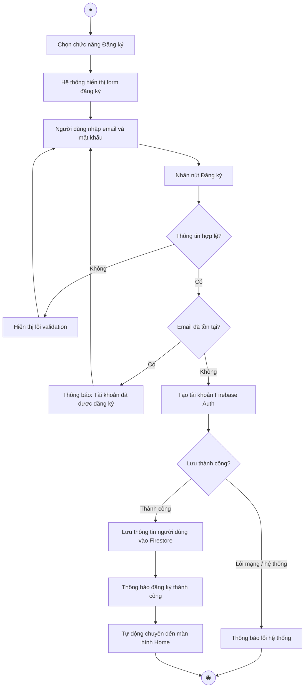

---

## UC-02 – Đăng nhập tài khoản

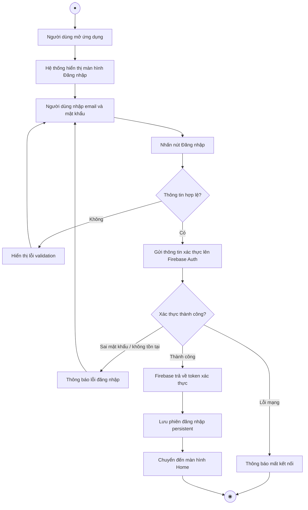

---

## UC-03 – Tạo bộ thẻ

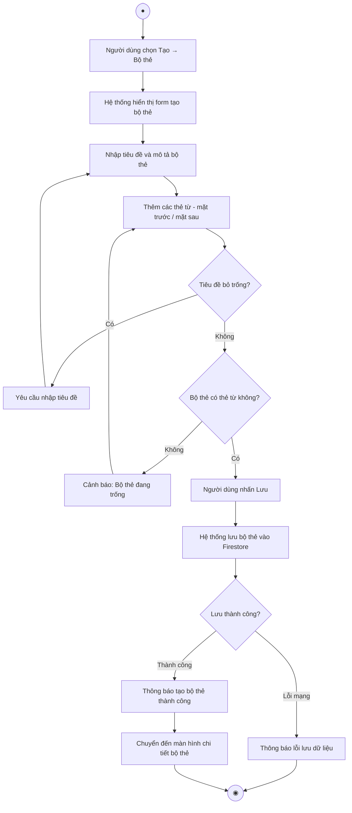

---

## UC-04 – Chỉnh sửa bộ thẻ

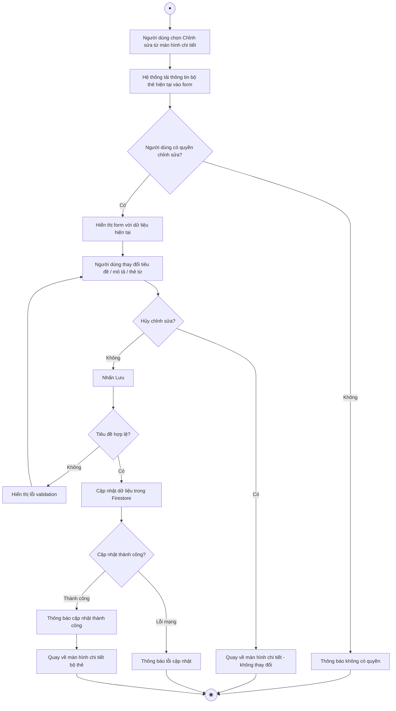

---

## UC-05 – Xem chi tiết bộ thẻ

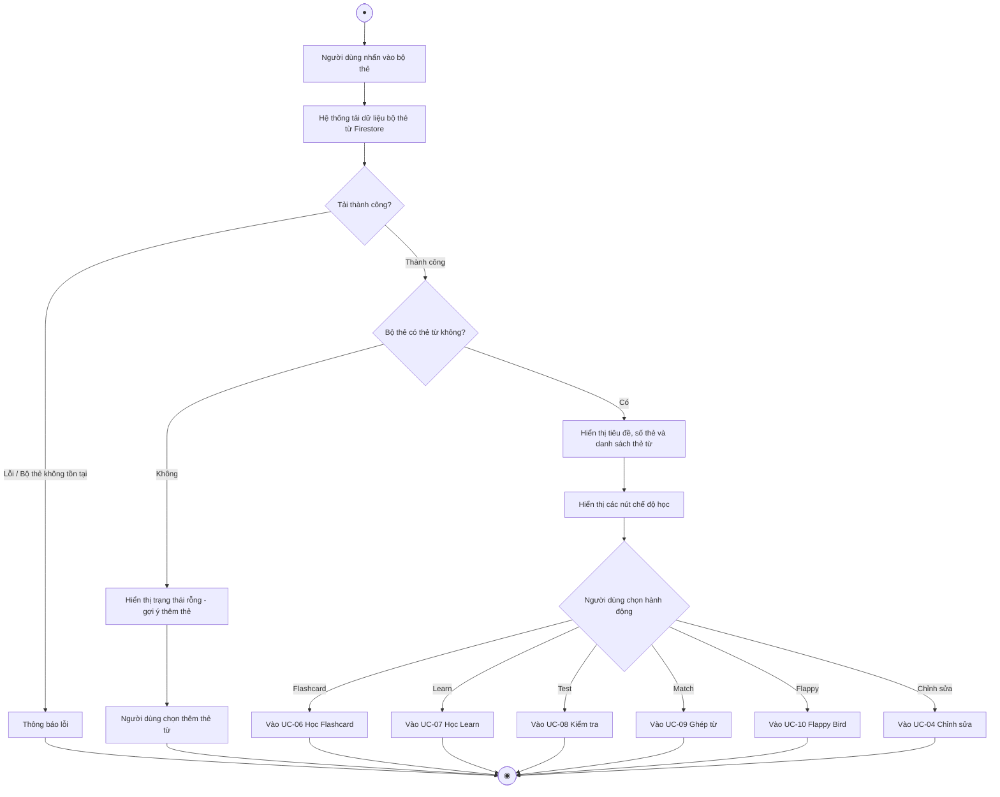

---

## UC-06 – Học Flashcard

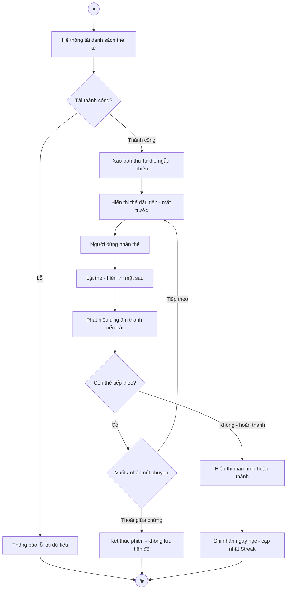

---

## UC-07 – Học theo chế độ Learn

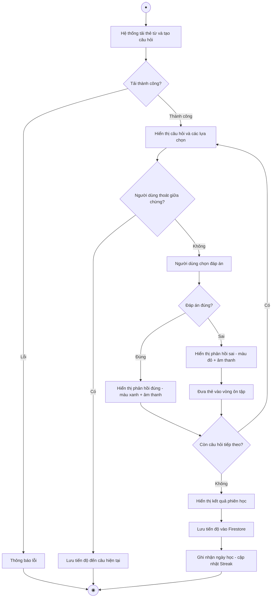

---

## UC-08 – Làm bài kiểm tra (Test)

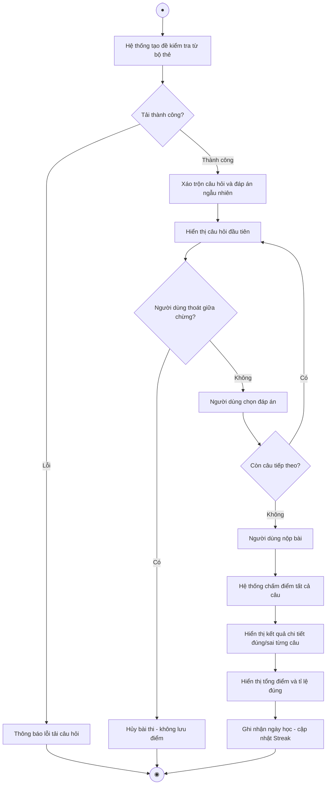

---

## UC-09 – Chơi trò chơi ghép từ (Match)

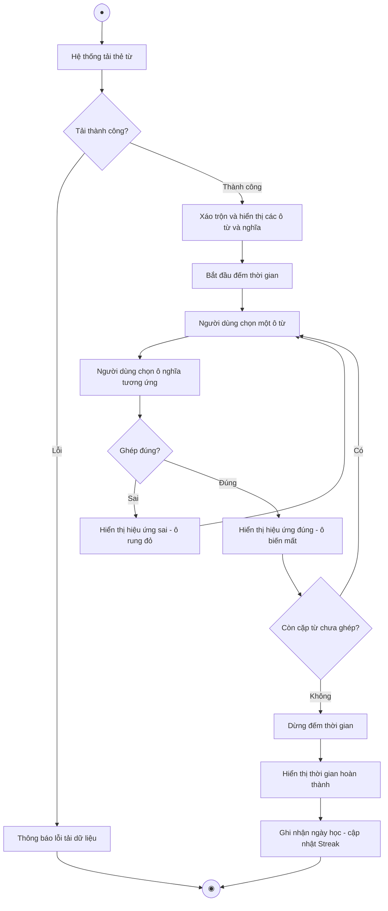

---

## UC-10 – Chơi Flappy Bird học từ vựng

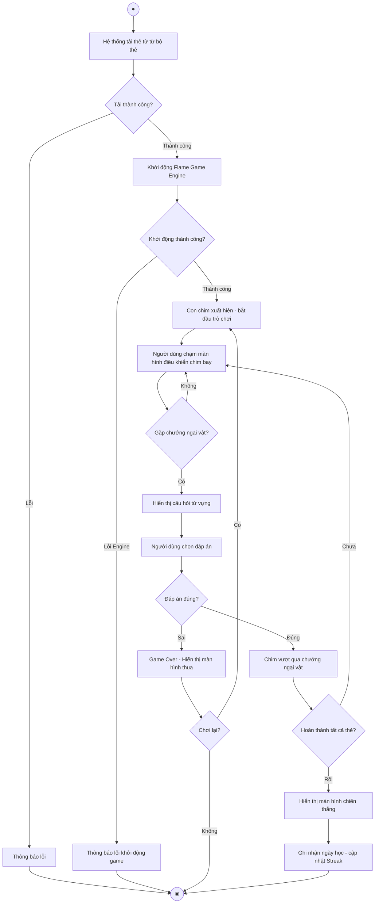

---

## UC-11 – Quản lý thư mục (Folder)

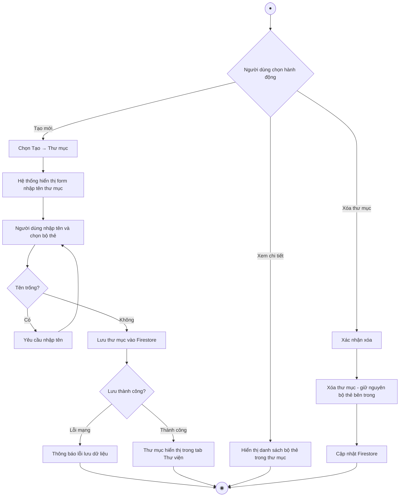

---

## UC-12 – Quản lý nhóm học (Group)

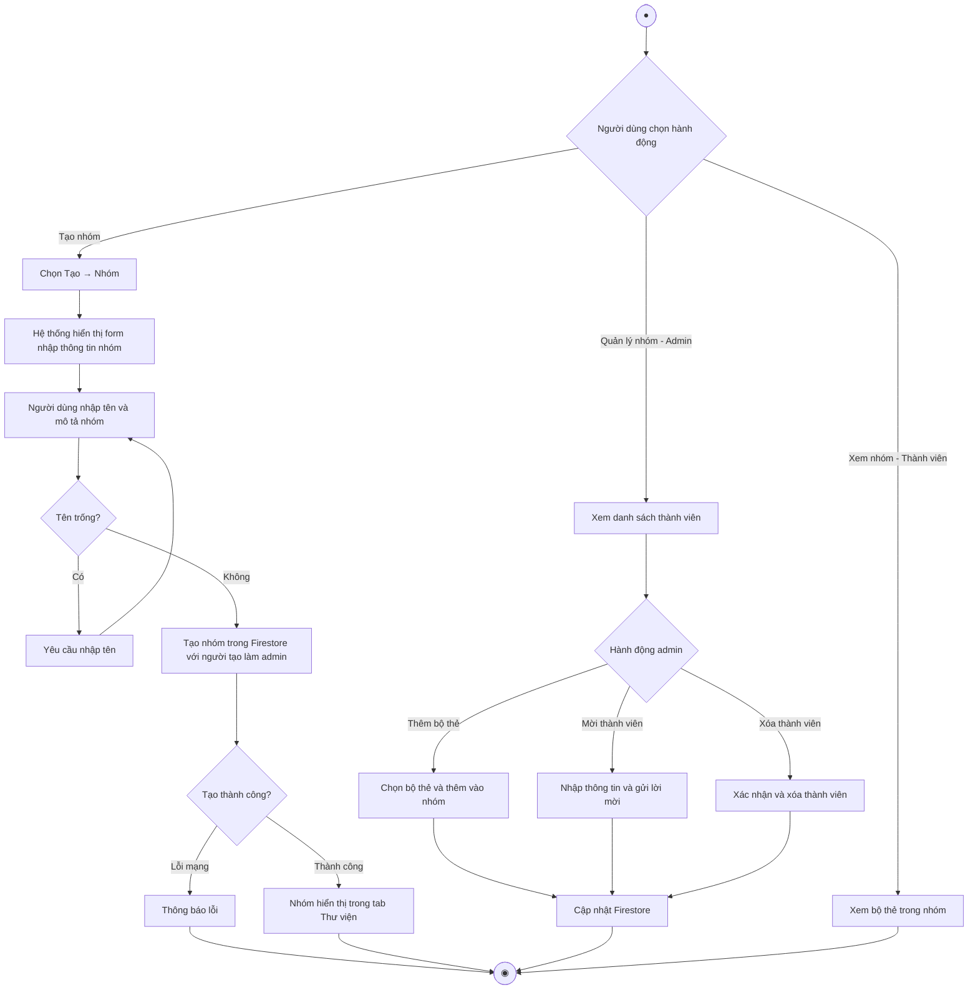

---

## UC-13 – Khám phá từ vựng theo cấp độ CEFR

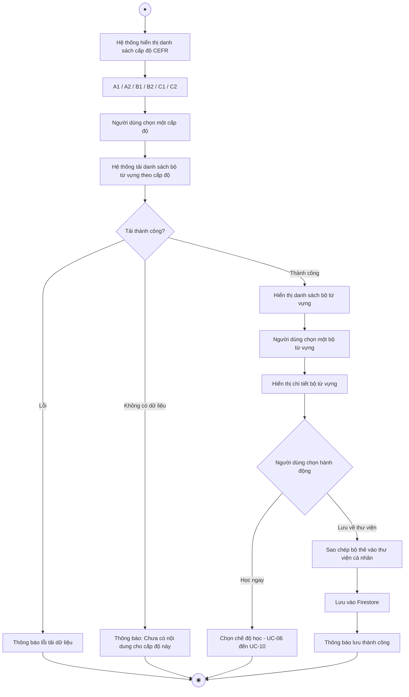

---

## UC-14 – Xem hồ sơ cá nhân & chuỗi học

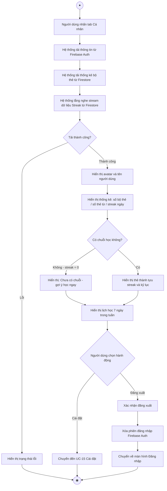

---

## UC-15 – Cài đặt tài khoản & ứng dụng

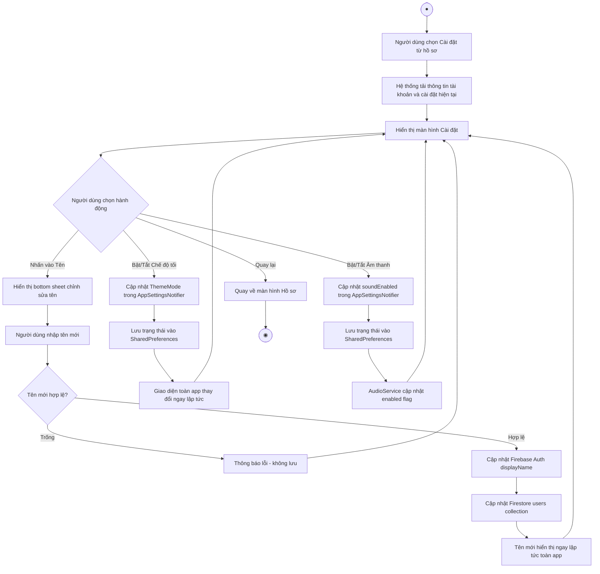
