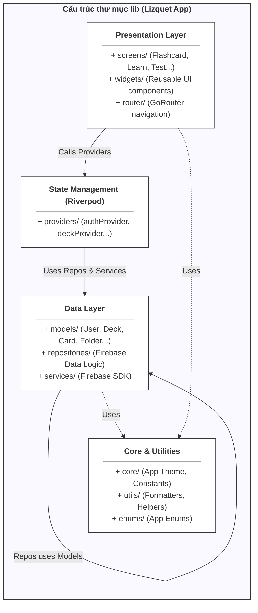
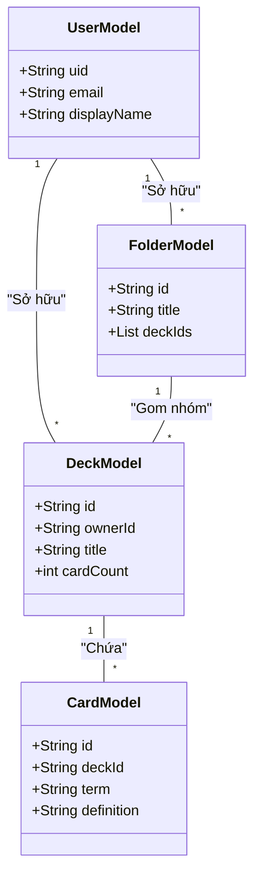

# TỔNG HỢP SƠ ĐỒ HỆ THỐNG LIZQUET

## 1. Sơ đồ Kiến trúc Phân tầng (Architectural Layers)
Sơ đồ này mô tả cách tổ chức code trong thư mục `lib`.



---

## 2. Sơ đồ Lớp (Class Diagram - Models & logic)
Sơ đồ này mô tả mối quan hệ giữa các đối tượng dữ liệu.



---

## 3. Sơ đồ Use Case (Chức năng người dùng)
Mô tả các hành động mà người dùng có thể thực hiện.

```mermaid
usecaseDiagram
    actor "Người học (User)" as U
    
    package "Hệ thống Lizquet" {
        usecase "Đăng nhập/Đăng ký" as UC1
        usecase "Tạo bộ thẻ (Deck)" as UC2
        usecase "Học Flashcard" as UC3
        usecase "Làm bài kiểm tra (Test)" as UC4
        usecase "Quản lý Thư mục" as UC5
        usecase "Tham gia Nhóm" as UC6
    }
    
    U --> UC1
    U --> UC2
    U --> UC3
    U --> UC4
    U --> UC5
    U --> UC6
```

---

## 4. Sơ đồ Kiến trúc Triển khai (Deployment Architecture)
Mô tả luồng kết nối giữa thiết bị người dùng và hạ tầng Cloud Firebase.

```mermaid
graph TD
    subgraph ClientTier ["<b>Client Tier - Mobile Device</b>"]
        direction TB
        Flutter["Flutter Framework"]
        OS["Android OS / iOS"]
        Flutter -- "Runs on" --> OS
    end

    subgraph Backend ["<b>Serverless Backend - Google Firebase</b>"]
        direction LR
        Auth["Firebase Authentication<br/>(Identity Management)"]
        Firestore[("Cloud Firestore<br/>(NoSQL Database)")]
        Storage[("Firebase Storage<br/>(Media Files)")]
        FCM["Cloud Messaging<br/>(Push Notifications)"]
    end

    OS -- "HTTPS<br/>(Token Verification)" --> Auth
    OS -- "WebSocket / HTTPS<br/>(Real-time Sync)" --> Firestore
    OS -- "HTTPS<br/>(Upload/Download)" --> Storage
    OS -- "Push Protocol<br/>(Notifications)" --> FCM

    %% Styling
    style ClientTier fill:#e1f5fe,stroke:#01579b,stroke-width:2px
    style Backend fill:#fff3e0,stroke:#e65100,stroke-width:2px
    style Auth fill:#ffffff,stroke:#333
    style Firestore fill:#ffffff,stroke:#333
    style Storage fill:#ffffff,stroke:#333
    style FCM fill:#ffffff,stroke:#333

---

## 5. Sơ đồ Tham chiếu (Reference Diagram)
Mô tả mối quan hệ giữa các Collection trong Firestore thông qua các trường liên kết.

```mermaid
graph TD
    %% Các thực thể (Entities)
    Users["<b>Users</b><hr/>String email<br/>String displayName<br/>Array joinedGroups<br/>String uid(PK)"]
    Decks["<b>Decks</b><hr/>String ownerId<br/>String title<br/>Number cardCount<br/>String id(PK)"]
    Folders["<b>Folders</b><hr/>String ownerId<br/>String title<br/>Array deckIds<br/>String id(PK)"]
    Groups["<b>Groups</b><hr/>String adminId<br/>String name<br/>Array memberIds<br/>String id(PK)"]
    Cards["<b>Cards</b><hr/>String deckId<br/>String term<br/>String definition<br/>String id(PK)"]
    Progress["<b>Progress</b><hr/>String userId<br/>String cardId<br/>Number boxLevel<br/>String id(PK)"]
    Notifications["<b>Notifications</b><hr/>String userId<br/>String title<br/>String id(PK)"]

    %% Các mối quan hệ (Relationships)
    Decks -- "ownerId -> uid (Người tạo)" --> Users
    Folders -- "ownerId -> uid (Người tạo)" --> Users
    Folders -- "deckIds -> id (Bộ thẻ trong thư mục)" --> Decks
    Groups -- "adminId -> uid (Quản trị viên)" --> Users
    Groups -- "memberIds -> uid (Thành viên)" --> Users
    Groups -- "deckIds -> id (Bộ thẻ chia sẻ)" --> Decks
    Cards -- "deckId -> id (Bộ thẻ chứa)" --> Decks
    Progress -- "userId -> uid (Người học)" --> Users
    Progress -- "cardId -> id (Thẻ đang học)" --> Cards
    Notifications -- "userId -> uid (Người nhận)" --> Users

    %% Styling
    style Users fill:#ffffff,stroke:#333,stroke-width:1px
    style Decks fill:#ffffff,stroke:#333,stroke-width:1px
    style Folders fill:#ffffff,stroke:#333,stroke-width:1px
    style Groups fill:#ffffff,stroke:#333,stroke-width:1px
    style Cards fill:#ffffff,stroke:#333,stroke-width:1px
    style Progress fill:#ffffff,stroke:#333,stroke-width:1px
    style Notifications fill:#ffffff,stroke:#333,stroke-width:1px
```

```

